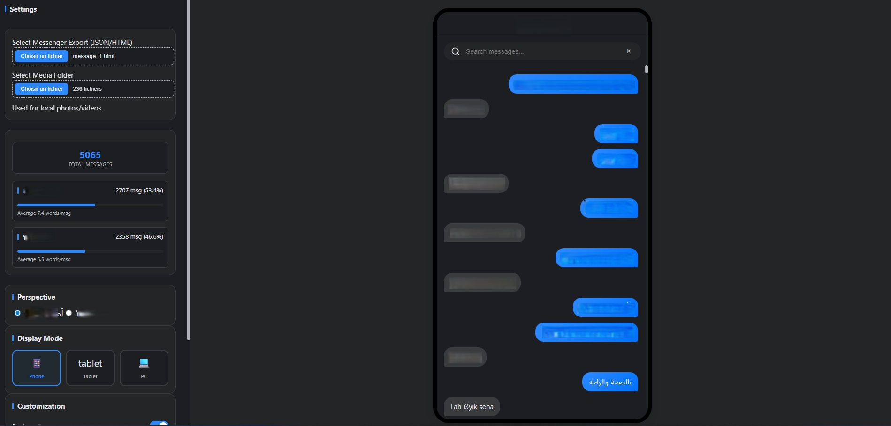

# 🚀 Messenger Mobile Viewer & Stats

A premium, localized tool to visualize and analyze your Facebook Messenger exports (JSON & HTML) with a stunning mobile-first interface.



## ✨ Features

- **📱 Messenger Mobile UI**: A pixel-perfect replication of the Messenger mobile interface with smooth animations and glassmorphism.
- **📊 Advanced Statistics**: Detailed dashboard showing message counts, participation percentages, and average word counts per sender.
- **🔍 Smart Desktop Search**: High-performance indexing and fuzzy search to find any message instantly, with diacritic-insensitive matching.
- **🖼️ Full Media Support**: View photos, videos, and listen to audio files directly within the chat. Handles local folders and base64 data URIs.
- **🌓 Dark Mode**: Seamless toggle between Light and Dark modes for comfortable night viewing.
- **🖥️ Display Modes**: Switch between **Phone**, **Tablet**, and **PC** views to suit your screen size.
- **🛡️ 100% Private**: Your data never leaves your computer. Everything is processed locally in your browser using JavaScript.
- **⚡ Performance Optimized**: Handles massive chat logs (100k+ messages) using virtual scrolling and memory management.

## 🚀 How to Use

1. **Export Data**: Go to Facebook "Download Your Information" and export your Messages in **JSON** or **HTML** format.
2. **Open Viewer**: Launch this application in any modern browser.
3. **Load Chat**: Select your `message_1.json` or `message_1.html` file.
4. **Load Media (Optional)**: If you want to see photos/videos, select the parent folder containing your exports using the "Select Media Folder" button.
5. **Explore**: Use the search bar, check your stats, and enjoy your memories!

## 🛠️ Deployment (GitHub Pages)

To host your own version of this tool for free on GitHub:

1. Create a new repository on GitHub.
2. Push these files to your repository:
   ```bash
   git init
   git add .
   git commit -m "Initial commit"
   git remote add origin https://github.com/YOUR_USERNAME/YOUR_REPO_NAME.git
   git push -u origin main
   ```
3. Go to **Settings > Pages** in your GitHub repository.
4. Under **Branch**, select `main` and click **Save**.
5. Your app will be live at `https://YOUR_USERNAME.github.io/YOUR_REPO_NAME/`.

## 📜 License

This project is licensed under the MIT License - see the [LICENSE](LICENSE) file for details.

## 👤 Author

Developed and maintained by **Yomix90**.
